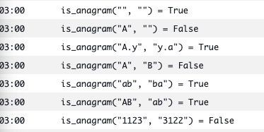
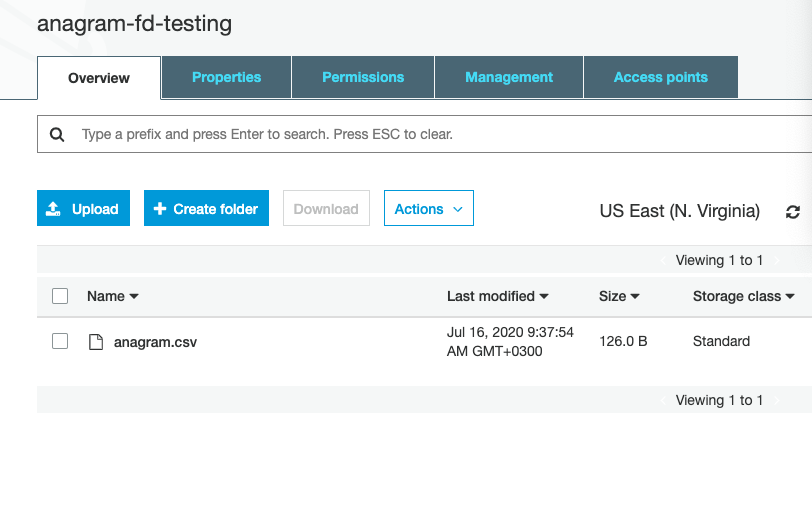
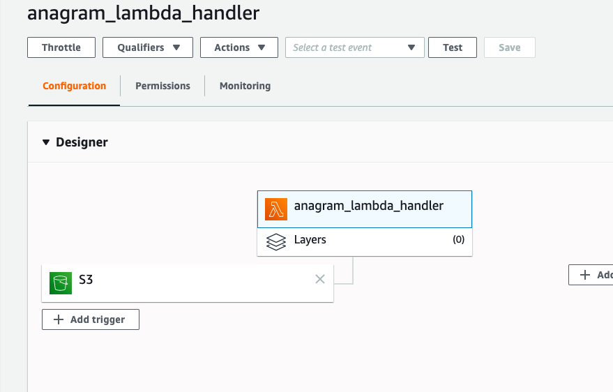

# simple-terraform-lambda-app
Simple app for learning purposes

## Run Commands

1. Init terraform \
   `terraform init` \
   (Make sure that your AWS credentials are defined)

2. Apply configuration files \
   `terraform apply -auto-approve`

## Some screenshots

 \
 \

